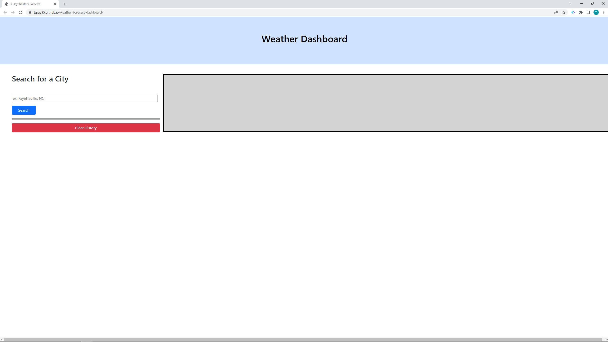

# Weather Forecast Dashboard

## Description

This web application enables the user to quickly and easily access weather forecasts for a chosen city. Current weather and a 5-day forecast are displayed for the active city. Searched cities are saved in local storage and displayed as buttons under the city search input field.

## Usage

Application is located at https://tgray95.github.io/weather-forecast-dashboard/. Type city same (followed by comma and 2-letter state code if in US) and click 'search' button to display weather for the chosen city. To display weather for any previously searched city, click on the button with the corresponding city name. To clear search history and remove previously searched city buttons, click 'clear history' button.

## Screenshot

